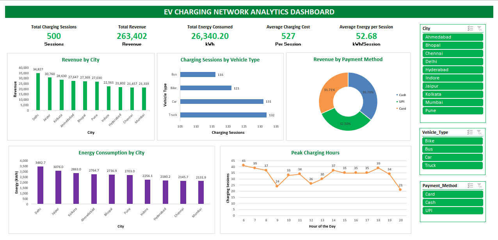
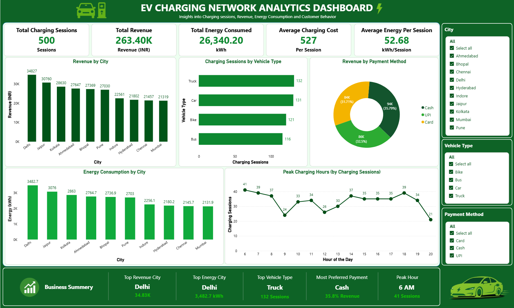

# 🖼️ Images

## EV Charging Network Analytics - Visualization Gallery

This folder contains all charts and dashboard screenshots generated during the EV Charging Network Analytics project.

These visualizations were created using **Python (Matplotlib)**, **Excel**, and **Power BI** to support business analysis and data-driven decision-making.

---

# 📊 Python Visualizations

## Revenue by City


Shows the total revenue generated from EV charging stations across different cities.

---

## Energy Consumed by City


Displays total energy consumption (kWh) for each city.

---

## Revenue by Payment Method


Illustrates the distribution of revenue across different payment methods.

---

## Charging Sessions by Vehicle Type


Shows the number of charging sessions for each vehicle category.

---

# 📈 Dashboard Screenshots

## Excel Dashboard



---

## Power BI Dashboard



---

# 💡 Key Insights

- Delhi generated the highest revenue.
- Delhi recorded the highest energy consumption.
- Trucks had the highest charging sessions.
- Cash was the most preferred payment method.
- Peak charging activity occurred at **6 AM**.

---

# 📂 Folder Structure

```text
Images/
│
├── Revenue_by_City.png
├── Energy_by_City.png
├── Payment_Method_Revenue.png
├── Vehicle_Type_Sessions.png
├── EV_Charging_Dashboard.png
├── EV_Charging_Dashboard_PowerBI.png
└── README.md
```

---

## 🚀 Purpose

This folder provides visual evidence of the analysis performed throughout the project. It helps recruiters and hiring managers quickly understand the project's outputs without opening the code or dashboards.
