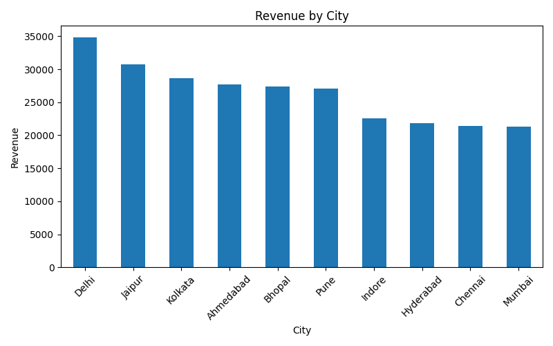
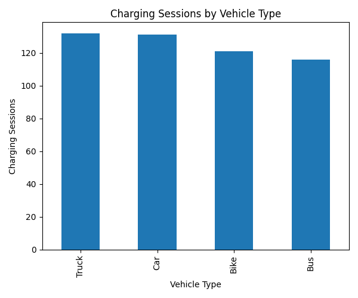
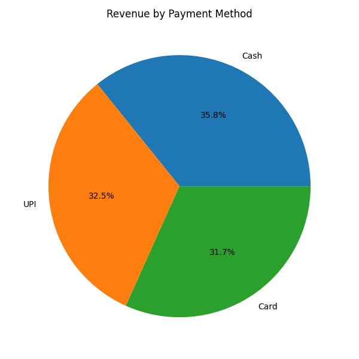
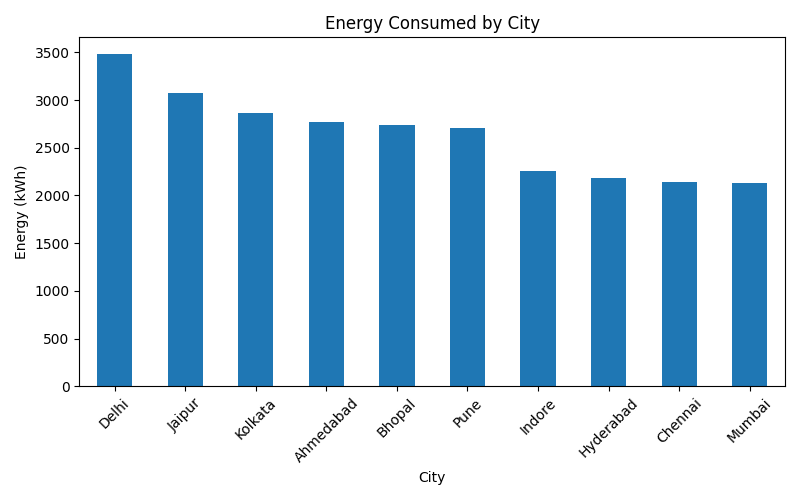

# 🐍 Python Analysis

# EV Charging Network Analytics

## 📌 Overview

This folder contains the complete Python-based Exploratory Data Analysis (EDA) for the EV Charging Network Analytics project.

The analysis was performed using Pandas and Matplotlib to explore charging sessions, revenue, energy consumption, payment methods, and vehicle types.

---

# 🎯 Business Objective

The objective of this analysis is to understand EV charging patterns, identify high-performing cities, analyze customer payment behavior, and generate actionable business insights through Python.

---

# 🛠️ Technologies Used

- Python
- Pandas
- Matplotlib

---

# 📂 Dataset

Dataset Used:

```
EV_Charging_Station.csv
```

---

# 📊 Analysis Performed

## Data Validation

- Displayed first and last records
- Checked dataset dimensions
- Verified column names
- Dataset information
- Missing value analysis
- Duplicate value analysis

---

## KPI Analysis

- Total Charging Sessions
- Total Revenue
- Total Energy Consumed
- Average Charging Cost
- Average Energy per Session

---

## Business Analysis

- Revenue by City
- Charging Sessions by Vehicle Type
- Revenue by Payment Method
- Energy Consumption by City

---

# 📈 Visualizations

## Revenue by City



---

## Charging Sessions by Vehicle Type



---

## Revenue by Payment Method



---

## Energy Consumed by City



---

# 💡 Key Insights

- Delhi generated the highest charging revenue.
- Jaipur ranked second in total revenue.
- Trucks recorded the highest charging sessions.
- Cash was the most preferred payment method.
- Delhi consumed the highest charging energy.
- Revenue and energy consumption showed similar city-wise trends.

---

# 📁 Files

```
Python/
│
├── EV_Charging_Station.py
└── README.md
```

---

# 🚀 Conclusion

Python analysis validates the business insights obtained from Excel and SQL. The generated visualizations provide a clear understanding of charging demand, revenue distribution, vehicle usage, and energy consumption across different cities.

This analysis forms an important part of the complete EV Charging Network Analytics project.
